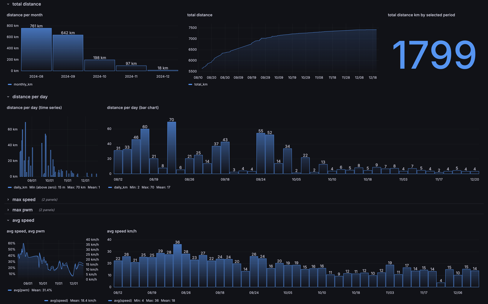

# EUC Telemetry

This solution creates a visualization system for monowheel logs using **Grafana**, **ClickHouse**, and a **Go** application (metrics-exporter). The metrics-exporter processes CSV log files ([WheelLog Android app](https://github.com/Wheellog/Wheellog.Android) format), and inserts them into **ClickHouse**. **Grafana** is used to visualize the data with a pre-configured dashboard.



## Components

- **Grafana**: A visualization tool connected to ClickHouse for analytics and graphing.
- **ClickHouse**: A fast, open-source columnar database for storing the monowheel logs.
- **Metrics Exporter**: A Go service that fetches CSV logs and inserts them into ClickHouse.

## Requirements

- Docker & Docker Compose

## Setup and Installation

### 1. Clone the repository

```bash
git clone https://github.com/deLiseLINO/EUC-Telemetry
cd EUC-Telemetry
```

### 2. Start the services

To start all services, run:

```bash
docker compose up
```

This will launch:
- ClickHouse
- Grafana
- Metrics exporter (for once)

### 3. Accessing Grafana

Once the services are running, you can access Grafana at [http://localhost:13000](http://localhost:13000).

- **Authentication**: Grafana is preconfigured to allow anonymous access with administrative privileges.
- **Dashboards**: A pre-configured dashboard is available and set as the default home dashboard. 

## Using Your Logs  

To use your logs, follow these steps:  

1. **Collect Logs**  
   - Use the **WheelLog** Android application to collect your ride data.  
   - The `Auto log` and `Continue the log of this day` options in the settings will help ensure your logs are continuous and up to date.  

2. **Place the Logs in the `wheel-logs` Folder**  
   - Place your log files in the `metrics-exporter/wheel-logs` folder of this repository.  

3. **Clean ClickHouse (if needed)**  
   - If ClickHouse already contains data (such as example data from previous runs), you need to clean the existing logs before importing new ones.  
   - You can do this in two ways:  
     - **Option 1**: Run `docker-compose down --volumes` to remove existing volumes and reset the database. This will also drop your Grafana data, so be carefull if you changed dashboards or something
     - **Option 2**: Manually clear the tables by running `TRUNCATE TABLE metrics;` and `TRUNCATE TABLE files;` in Grafana explore http://localhost:13000/explore or any ClickHouse client.  
   - This step is necessary only if the database was previously populated with example data from the `metrics-exporter/wheel-logs` folder.

4. **Run the Services**  
   - Use Docker Compose to start the services. Run the following command in the root directory:  

     ```bash
     docker-compose up
     ```

5. **Add New Log Files**  
   - To add new logs, place the new CSV files in the `metrics-exporter/wheel-logs` folder.  
   - After adding the new log files, **restart the services** to process and insert the new data into ClickHouse.  
     - Run the following command to restart the metrics-exporter:  

     ```bash
     docker-compose up
     ```

   - The **metrics-exporter** will automatically process the new files, and the data will be available for visualization in Grafana.  

## Possible Improvements

- **HTTP Server for Log Uploads**: An HTTP server with an endpoint that will accept CSV files containing logs. This will replace the current method of fetching logs from a local folder.
- **Multiple Groups Data Management**: The ability to store logs in multiple groups, allowing users to switch between them in Grafana.
- **Support for other Log Formats**: Export logs from applications like **Darkness Bot** or **EUC World**.

These improvements would allow for easier deployment in production environments, with the ability to upload logs remotely and handle data from various sources.

For now, the app is designed primarily for local use.

## Troubleshooting

If issues arise:

- Verify that the Go application is correctly fetching and processing CSV logs.
- Check the logs of the Go application container using `docker logs <go-app-container-id>` to find errors related to data insertion.
- If Grafana cannot connect to ClickHouse, ensure that the ClickHouse container is running and that Grafana's data source is configured properly.

---

